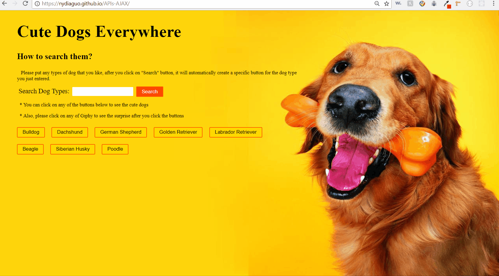

# GifTastic
## :question: What is it?
In this APP, I used the GIPHY API to make a dynamic web page that populates with gifs of a specific choice.

## :bulb: How to use it

- Input any types of dogs that you want, then click the **Search** button

- The APP will automatically the `button` for the dog

- As you click on it, you will see the dog gifs that you just entered

- Try to click on any pics to see the moving

## Screen Shots

## Functionality
GifTastic mainly used AJAX call to hit Giphy's API to get the specific data that users want to search, which based on the core of functions as below:

1. Once got the API key, I used the `AJAX` call with the `GET` method to hit Giphy Website.

2. After Giphy responses, loading the giphy pics with using a `for` loop.

3. Using another function with `on click` event to trigger the each pic if the users want to be still or animated.

## Technologies used 
- [Node.js](https://www.nodejs.org/en/)
- [CSS](https://www.w3.org/Style/CSS/Overview.en.html)
- [Bootstrap](https://getbootstrap.com/)
- [jQuery](https://jquery.com/)
- [JavaScript](https://www.javascript.com/)